# Основы веб-верстки HTML/CSS

## Урок 14. Семинар. Структура HTML5 и методология БЭМ

### Задание:

Макет [https://www.figma.com/file/mnLY69cYE5cqWM5w6n5hXx/Seo-%26-Digital-Marketing-Landing-Page?node-id=189%3A839](https://www.figma.com/file/mnLY69cYE5cqWM5w6n5hXx/Seo-%26-Digital-Marketing-Landing-Page?node-id=189%3A839)

В данном уроке мы переходим к созданию мобильной версии проекта

1. Создать медиа запрос, чтобы наш проект отлично смотрелся на разрешениях экрана 320-767.
2. Создать мобильную версию проекта

### Решение

Решение представлено в текущей папке. Корневой файл - [index.html](index.html)

### Результат работы:

- Текст на верхнем баннере исправил в соответствие с шаблоном.
- В версии для планшета выыровнял карточки категорий

#### Адаптивная верстка под мобильное устройство:

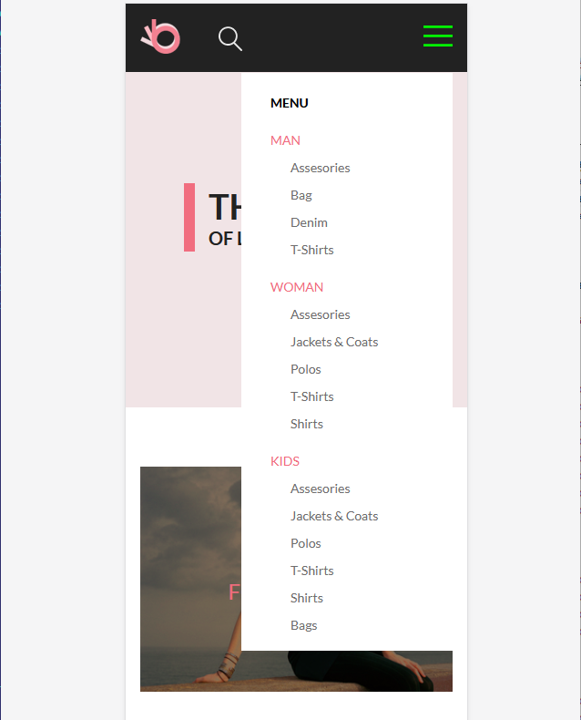
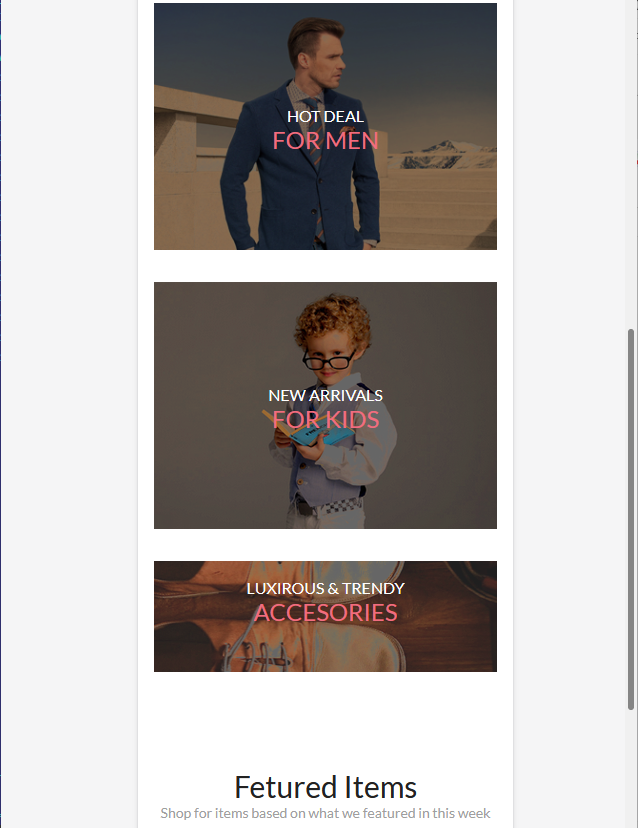
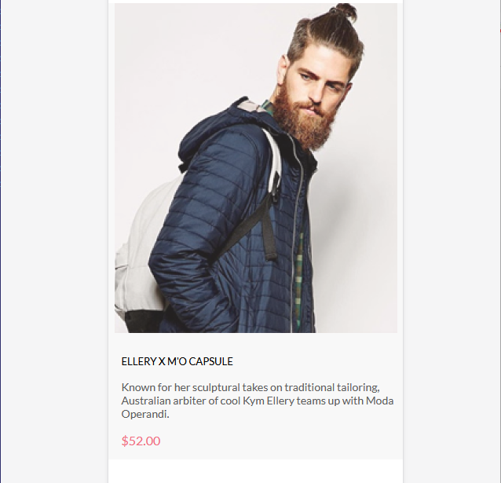
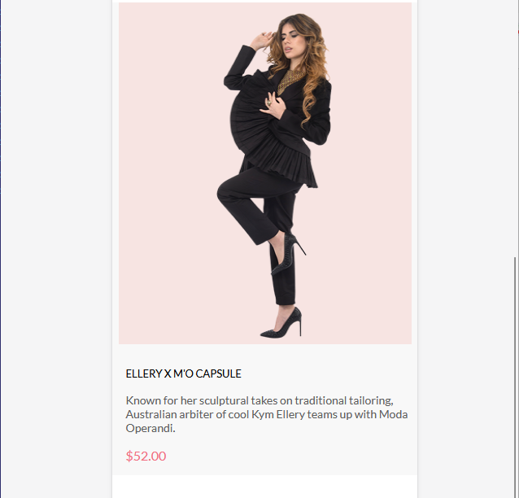
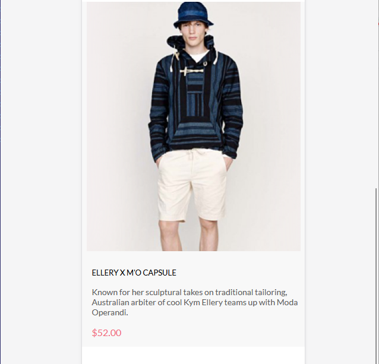
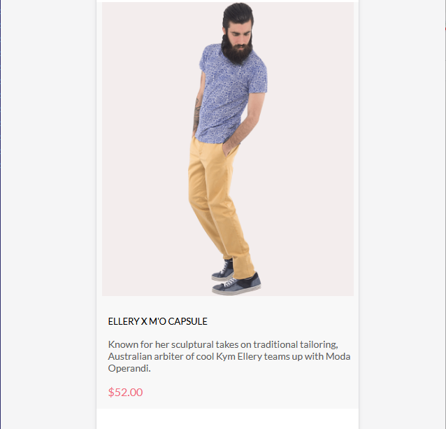
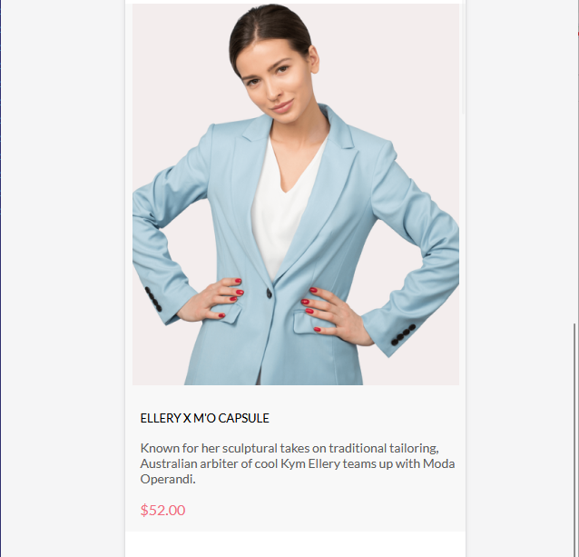
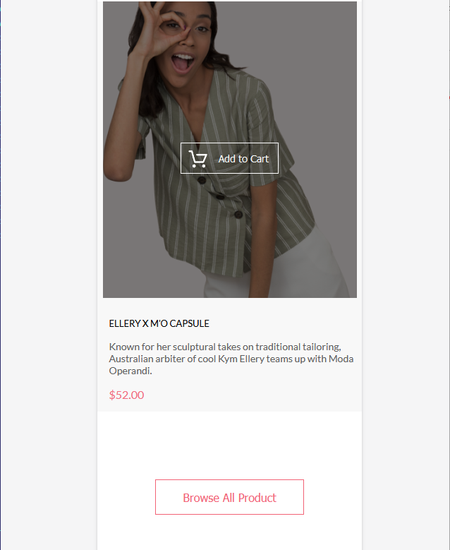

#### Адаптивная верстка под планшет:

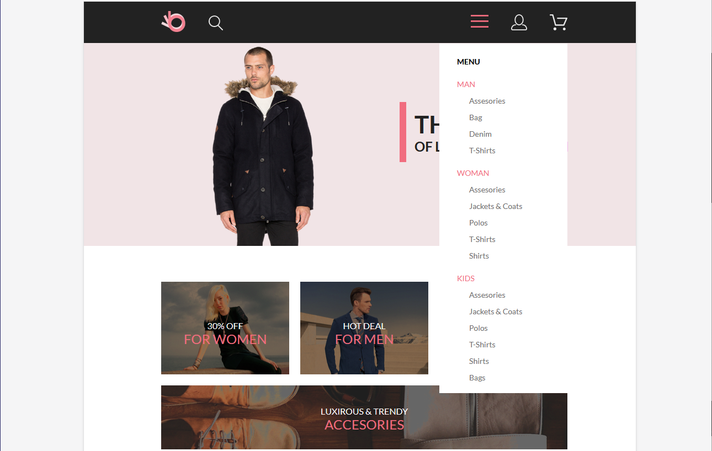
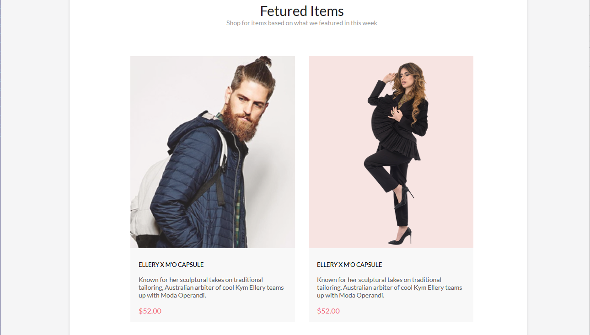
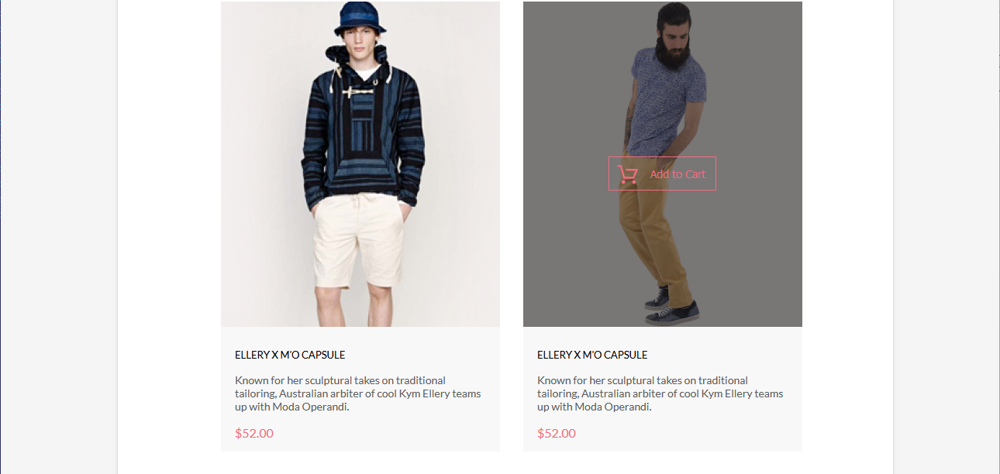
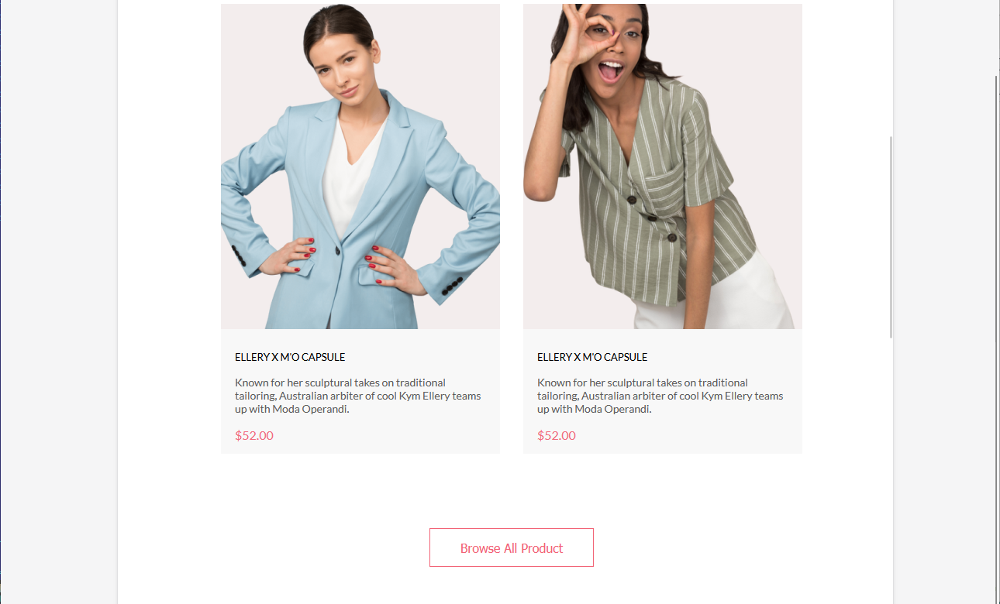

#### Адаптивная верстка под десктоп:

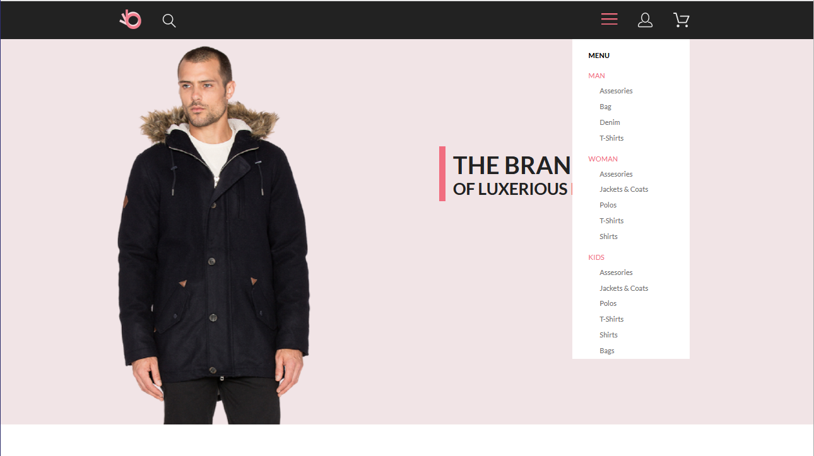
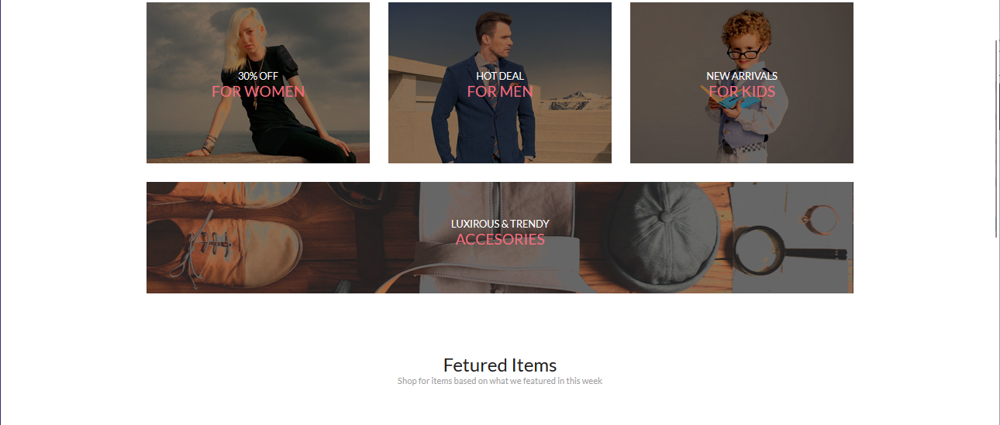
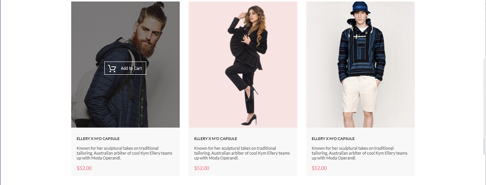
